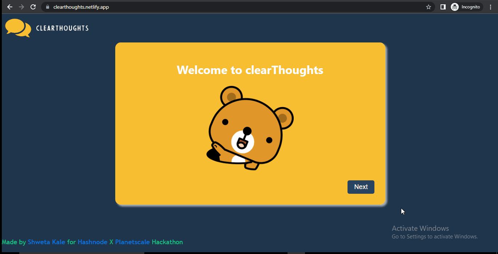

<div align="center">
  <a href="https://github.com/raibove/clearthoughts-frontend">
    
  </a>
<h3 align="center">clearThoughts - Express yourself more clearly and confidently !!</h3>

<p align="center">
  Do you have ideas you’re trying to convey to others, and you just can’t seem to express yourself?
  <br/>
  Do you ever feel like you can’t even tell a story? 
  <br/>
  <br/>
  clearThoughts is a tool that will help you improve your communication skill. You can make use of what we see, feel and hear to express it to the listners, clearThoughts will serve as a guide so that you can improve your skill and practice.
</p>
</div>



---

## Links

GitHub: [Front-End](https://github.com/raibove/clearthoughts-frontend) / [Back-End](https://github.com/raibove/clearthoughts-backend)

Hashnode Article: [link]()

Deployed Links: [Site](https://clearthoughts.netlify.app/)

--- 
## Running Locally 💻

#### #1. Clone the repo

```sh
git clone https://github.com/raibove/clearthoughts-frontend.git
```

#### #2. Install the dependencies

```sh
npm install
```

#### #3. Start server

```sh
npm start
```

Tables will be created in PlanetScale

Made as part of [PlanetScale](https://planetscale.com) x [Hashnode](https://hashnode.com) hackathon.
